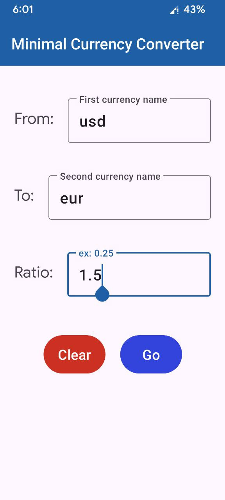
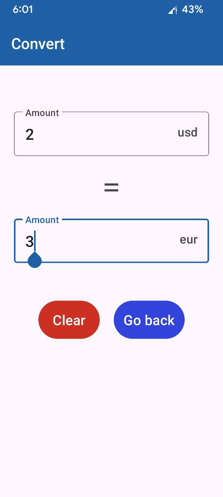

#  Minimal Currency Converter application

A minimal currency converter app. Offline, simple and fast.

## What is it?
It is a very lightweight android app designed for quick, offline currency conversion.
Ideal for travelers and anyone needing a fast, reliable conversion tool without any extra features.
It just does what is supposed to do nothing else.

## Usage
| Main Screen | Conversion Screen |
|:---:|:---:|
| The first screen is used to input the name of the currencies and the conversion ratio (pay attention to the direction of the conversion) | The second screen will have the amount input with the automatic display of the corresponding amount in the other currency |
|  |  |

It will automatically save the inputs, so that if you close the application it will resume right from the conversion screen, for fastest usage.

## License

Copyright (C) 2025 simone-05

This program is free software: you can redistribute it and/or modify it under the terms of the GNU Affero General Public License as published by the Free Software Foundation, either version 3 of the License, or (at your option) any later version.

This program is distributed in the hope that it will be useful, but WITHOUT ANY WARRANTY; without even the implied warranty of MERCHANTABILITY or FITNESS FOR A PARTICULAR PURPOSE. See the GNU Affero General Public License for more details.

You should have received a copy of the GNU Affero General Public License along with this program. If not, see <https://www.gnu.org/licenses/>.

Full license: [AGPL-3.0](LICENSE)
